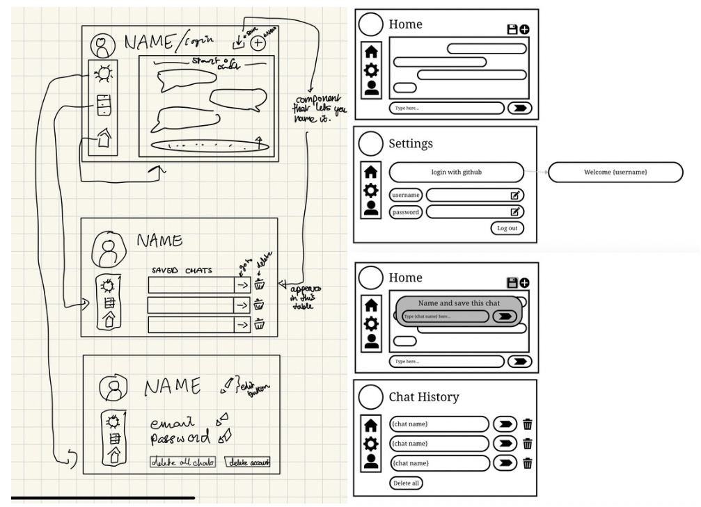

# User Interface Design and Development

## Initial Wireframing and Diagrams

To start with, we decided to create low and high fidelity wireframes of the application we wanted to create, in order to understand how the components would all work together initially

Then, based on what we needed, we created a use case diagram of the interaction between the user and the front-facing app from the user's point of view, showing how each thing the user can do/interact with connects with each other component within the application.

