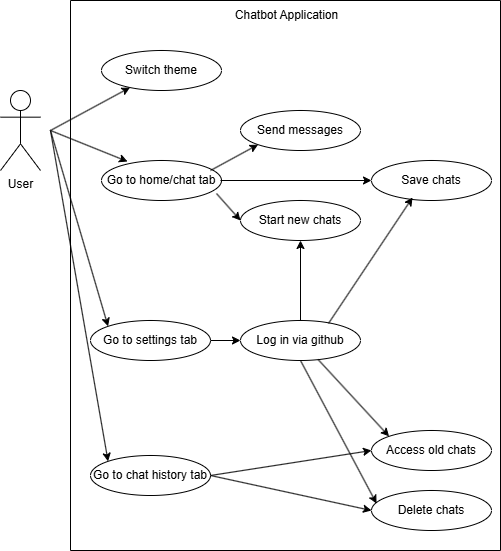

# User Interface Design and Development

## Initial Wireframing and Diagrams

To start with, we decided to create low and high fidelity wireframes of the application we wanted to create, in order to understand how the components would all work together initially

Then, based on what we needed, we created a use case diagram of the interaction between the user and the front-facing app from the user's point of view, showing how each thing the user can do/interact with connects with each other component within the application.

## Building the User Interface

In terms of actually creating the application, although settling on .NET MAUI we considered blazor as well, but eventually settled on MAUI as it doesn't require JS interop unless you're embedding web content, and gives full native API access. .NET MAUI also works well with XAML and other .NET projects, and allows you to only need a single build in C#/XAML so made the most sense for us to keep our project as modernised as possible.
