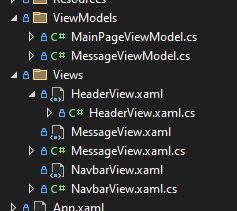

# Design Portfolio - Architecture

## MVVM
We decided to use the Model-View-ViewModel or MVVM design pattern because it helps us to clearly separate the business logic from the user interface. This allows us to keep code testable, maintainable and reusable. MVVM works well with .NET MAUI as it breaks up what would be tight coupling with the XAML UI and the code behind that still operates within the UI. MVVM has the three core components, shown in the diagram below, but has limited access to each other, allowing the model to evolve independently of the view. This allows the app UI to be redesigned without touching the view model or model code, as our view has been implemented in XAML/C#. This also allowed us to work concurrently. 

This is an example of the MVVM file structuring we have used in our code to keep adhering to this design pattern.

## Tech Stack - .NET MAUI v. Blazor/Razor
Both .NET MAUI nd Blazor are technologies for application development, but cater to different platforms. We chose to work with .NET MAUI primarily as it focuses on cross-platform applications, being able to work from mobile to desktop apps. MAUI also pairs well with XAML and C#, utilising native platform control.

In terms of actually creating the application, although settling on .NET MAUI we considered blazor as well, but eventually settled on MAUI as it doesn't require JS interop unless you're embedding web content, and gives full native API access. .NET MAUI also works well with XAML and other .NET projects, and allows you to only need a single build in C#/XAML so made the most sense for us to keep our project as modernised as possible.
