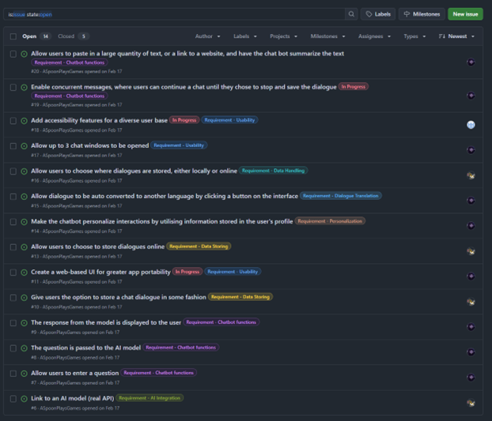

# Design Portfolio - Problem Analysis

## Problem Statement
As AI-powered tools become more popular for tasks like answering questions and holding conversations, there’s a growing need for chatbot applications that are not only intelligent, but also easy to use, customizable, and clear about how they handle user data. Many existing chatbots don’t offer much in terms of personalization, and they often don’t give users control over how their data is stored or used. This makes AI less accessible, especially for users who aren’t highly technical, and raises concerns around privacy and trust.\
NovaChat is being designed to address these gaps by providing a web-based chatbot that’s user-friendly, secure, and flexible. The system will include features like user authentication, integration with an AI model (initially using a stub for development), multilingual support, and options for storing chat data either locally or online. It will also support personalization through user profiles and allow users to summarize long text or website content.\
The goal is to build a solid minimum viable product (MVP) that focuses on core functionality while following good software design principles, such as encapsulation and separation of concerns. NovaChat is intended to make AI interactions more practical, trustworthy, and accessible to a wider range of users.

## Functional Requirements
1.	User Registration and Login:\
1.1. Users should be able to create accounts and store user credentials , (in some
fashion), that are needed to create & log in to the account.\
1.2. Secure login functionality for registered users.
2.	AI Integration:\
2.1. Link to an AI model – Use a Fake, (Stub/Shim), until actual links to API are available.
3.	Usability:\
3.1. Create an intuitive forms-based User Interface (UI) for easy navigation.
4.	Chatbot functions:\
4.1. Allow users to enter a question.\
4.2. The question is passed to the AI model.\
4.3. The response from the model is displayed to the user
5.	Data storing:\
5.1. Give users the option to store a chat dialogue in some fashion. (E.g. local file)
6.  Usability:\
6.1. Create a web-based UI for greater app portability
7.  Data Storing:\
7.1. Store user credentials online (eg. NoSQL/SQL database or similar)\
7.2. Allow users to choose to store dialogues online.

#### Assumptions based on Functional Requirements
-	The development will initially focus on desktop/laptop compatibility
-	All UI/UX will follow standard accessibility guidelines (WCAG 2.1) to support usability
-	OAuth or social logins are not in the initial plan
-	Final AI integration assumes a stable, pre-existing API with a JSON-based request/response method.
-	Text will be plain text only, no images, video or voice input.
-	The application will only be used one-to-one (user <-> AI) so no need for multi-user features.
-	Initial storage could be a text file.
-	Data will be tied to user account when stored online.
-	Assumption of internet access and access to all the tools in order to run the application for the purpose of assessment (such as modern browser with javascript support and accessibility tools)

## Non-Functional Requirements
1.	Personalization:\
1.1. Make the chatbot personalize interactions by utilising information stored in the user’s profile.
2.	Dialogue translation:\
2.1. Allow dialogue to be auto converted to another language by clicking a button on the interface.
3.	Data Handling\
3.1. Allow users to choose where dialogues are stored, either locally or online
4.	Usability:\
4.1. Allow up to 3 chat windows to be opened\
4.2. Add accessibility features for a diverse user base.
5.	Chatbot Functions:\
5.1. Enable concurrent messages, where users can continue a chat util they chose to stop and save the dialogue.\
5.2. Allow users to paste in a large quantity of text, or a link to a website, and have the chat bot summarize the text.

#### Assumptions based on Non-Functional Requirements
-	Personalisation will be basic- greeting by name etc.
-	Language support will use external translation API and limited to pre-defined set of languages (ie. EN, ES, FR)
-	Translations are approximate, may not guarantee contextual nuance
-	AI model is capable of handling longer text inputs
-	Summarisation will be brief and high-level

  ## Github issues for tracking requirements

  Using these requirements, we created a list of github issues, which was an incredibly efficient way for us to track our progress throughout the project.

  

