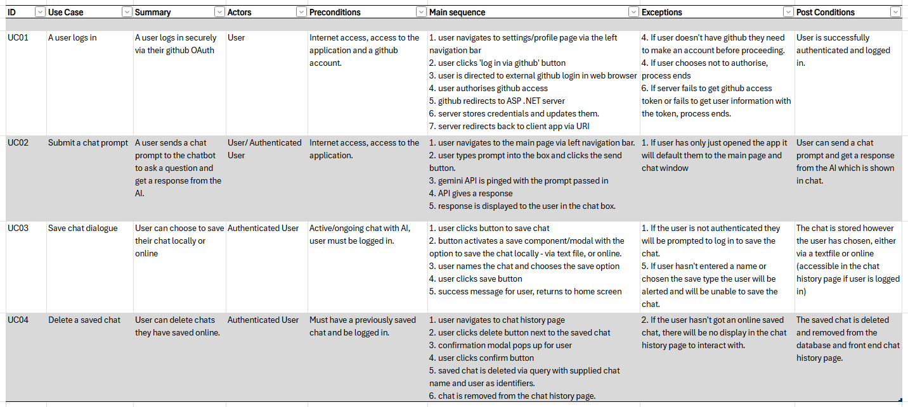
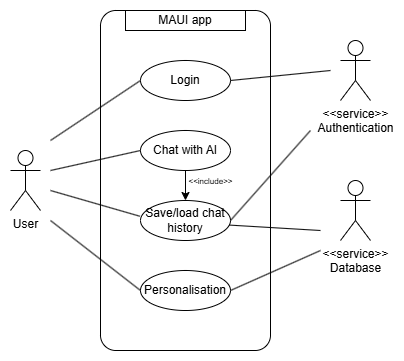
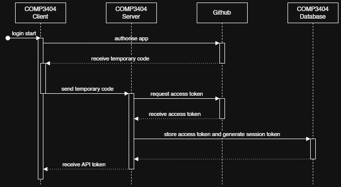
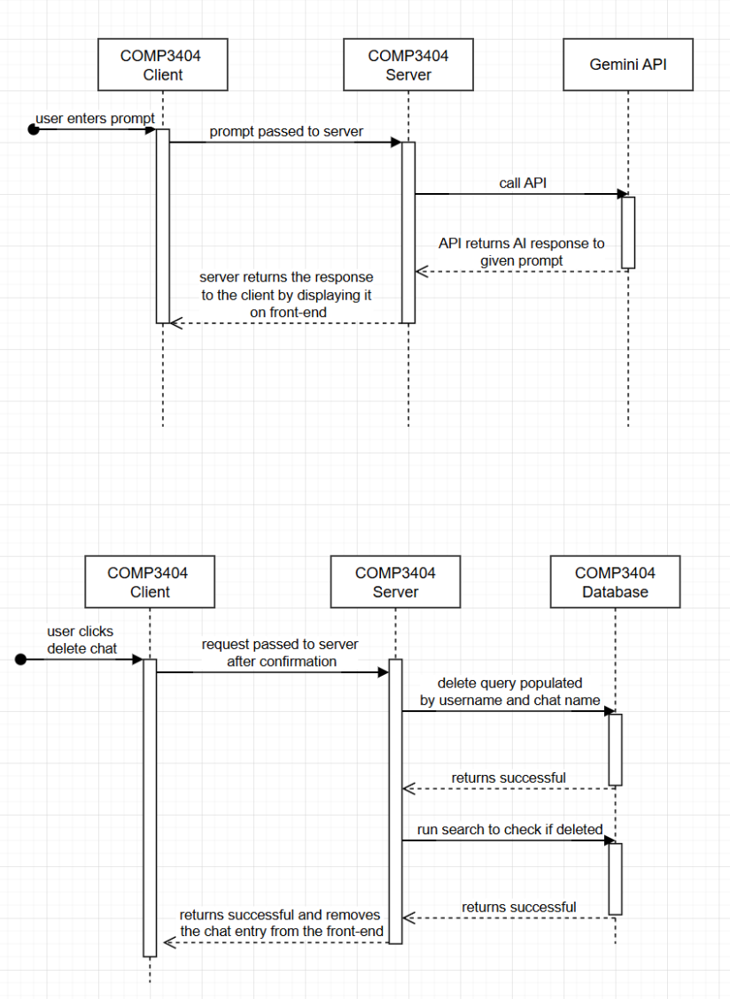

# Design Portfolio - Technical Design

## Design Considerations
When we started the technical design, we wanted to bear a few considerations in mind to keep our code adequately compartmentalised, and adhering to design strategies such as loose coupling, high cohesion and separation of concerns.\
Some key considerations we came up with were:
- All API and authentication related process should be handled server-side to keep them separate from the user interface and obscure more technical processes from the user.
- We should create reusable components for the UI to avoid duplication and support cohesive, clean and testable code.
- We should pass data explicitly instead of using global variables to avoid unnecessary coupling between unrelated parts of the system.
- We need to keep the AI integration loosely coupled so that we can easily substitute the stub for the real API later down the line.

## Use Case Descriptors
Given these considerations, we started to create our use case descriptors in order to start mapping out how components would connect and things we needed for our application and it's infrastructure. This table helped us visualise what we were aiming to achieve much easier with a focus on the processes the system would need to work through as well as being able to identify actors and edge cases if something was to go wrong.

With the biggest process being identified as the authentification process for logging in, we decided to create a use case diagram to visualise it a little better.\

## Sequence Diagrams
Given the use-case descriptors we came up with, we decided to create sequence diagrams of the authentication/login process, sending prompts to the AI API and getting responses as well as the process for deleting chats, 3 key processes we needed to get right in order to successfully create our MVP.\
This first one is the auth process we created a use-case diagram for as shown above. The difference between these diagrams being that the use-case shows what the system does functionally, and this sequence diagram showing the behaviour over time and how data is passed around.
\
These two sequence diagrams show different ways the user can interact with chats, with the top one being the user sending a prompt into the chatbot, along with how the API is called and returns a response. The second diagram shows the process that the user does not directly see when they delete an online saved chat, looking at the connection with the database and verifying that the right thing has been deleted before returning a success message to the user.

## SOLID Principles
So before we get into SOLID principles, there may be a question of 'where are the CRC cards in the previous section?' however, we decided as a group not to produce any CRC cards because they assume multiple responsibilities and tasks for every class, and this goes directly against the Single Responsibility Principle. The SRP states that each module should only have one reason to change, or be responsible for one thing only, to promote modularity, making code more maintable and testable, as well as much easier to read. Instead of this, for class discovery to help us map responsibilities to classes/components we took an approach of going through the brief and picking out key nouns, such as Chat, Account and AI and created classes such as ChatController, AccountController, which are used in the API and an interface named IAIModel with two classes named StubAIModel and GeminiAIModel. We also defined classes and view models for each page and component to keep everything separated, such as SettingsPage, SettingsPageViewModel and MessageView and MessageViewModel.\

In addition to SRP, we've also adhered to the SOLID principle of Interface Segregation by keeping our interfaces small and only implementing classes to be dependent on the interfaces they need.
