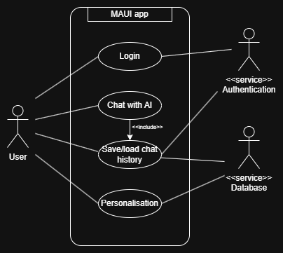

# Design Portfolio - Technical Design

## Design Considerations
When we started the technical design, we wanted to bear a few considerations in mind to keep our code adequately compartmentalised, and adhering to design strategies such as loose coupling, high cohesion and separation of concerns.\
Some key considerations we came up with were:
- All API and authentication related process should be handled server-side to keep them separate from the user interface and obscure more technical processes from the user.
- We should create reusable components for the UI to avoid duplication and support cohesive, clean and testable code.
- We should pass data explicitly instead of using global variables to avoid unnecessary coupling between unrelated parts of the system.
- We need to keep the AI integration loosely coupled so that we can easily substitute the stub for the real API later down the line.

## Use Case Descriptors
Given these considerations, we started to create our use case descriptors in order to start mapping out how components would connect and things we needed for our application and it's infrastructure. Once we had a list of descriptors we created a basic use case diagram of the authentification process.

## Sequence Diagrams

## SOLID Principles
