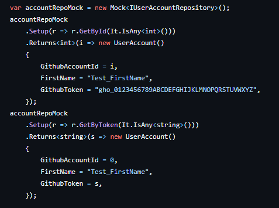
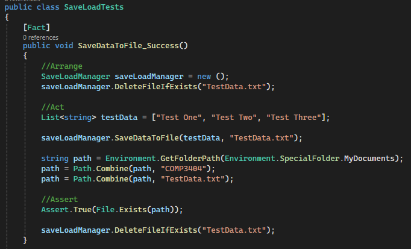

# Design Portfolio - Test Driven Development

We took a TDD approach to our project, implementing test stubs to help us work out what each class and component needed to do in order to work. We made sure to try and cover integration testing, mock testing, user acceptance and unit testing.

## Integration Tests

// to do

## Mock Testing
For mock testing, we used the Moq library, which integrated nicely with Visual Studio and XUnit. Moq implements fake versions of classes or interfaces so that individual components can be tested, desptite containing dependencies. This is an example of part of the Act section of a unit test, where we are mocking a database repository interface in order to test an endpoint's logic properly.

Since the goal of the test isn't to test the database, a fake (mock) implementation of it is injected into the API controller so that the API controller can be tested individually. Commonly mocked classes include `HttpMessageHandler` and database repository interfaces, as most API endpoints depend on these. This allows us to test cases where a request is malformed, or the database gives an unexpected result and ensure that the API endpoints handle these cases gracefully.

## Unit Testing
This is an example of unit testing that we built for the save-load testing suite. This test is to check the file is successfully saved, which was a key thing we needed to do to create our MVP. This is a good example of TDD because we needed to map out the different states and check that the code behaved as expected once it was implemented.

## User Acceptance Testing
User acceptance testing was used comparatively little compared to other forms of testing, as it is a manual process and not automatable.
Each requirement was tested before closing the corresponding Github issue, and the requirements were tested repeatedly as development continued to respond quickly to any regressions.

