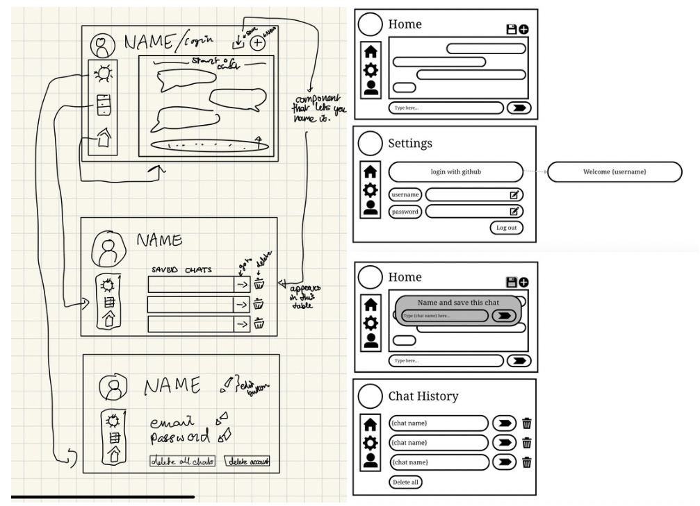
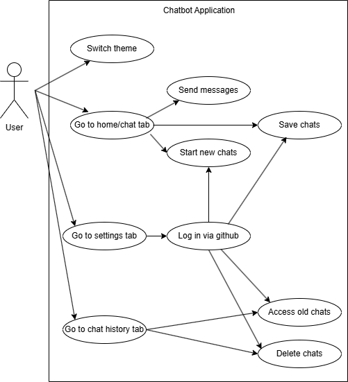

# Design Portfolio - User Interface Design

## Wireframing

When we started wireframing we decided we wanted an easily accessible and straightforward application with clear icons and components for users to optimise their experience. We tried to create a friendly UI that didn't overcomplicate what we were trying to achieve, without any over-the-top graphics or distractions from the main purpose of the app, which was the AI Chatbot component. We did this by placing the chat component on the main page, and making everything else accessible via a side navigation bar. We created both low and high fidelity wireframes to get a better understanding of each component we wanted and how it would integrate with other components.

Then, based on what we needed, we created a use case diagram of the interaction between the user and the front-facing app from the user's point of view, showing how each thing the user can do/interact with connects with each other component within the application.

## UX Influenced Decisions

A lot of our decisions in placement for various buttons and components were influenced by already existing AI chatbots to keep a sense of familiarity for new users who may have used other features before. On top of this, we decided to use icons or emoticons for the buttons to make them easily portable cross-platform like the brief plans for the application to eventually be.
